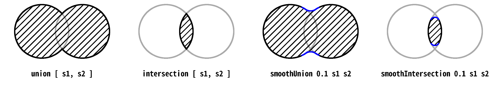
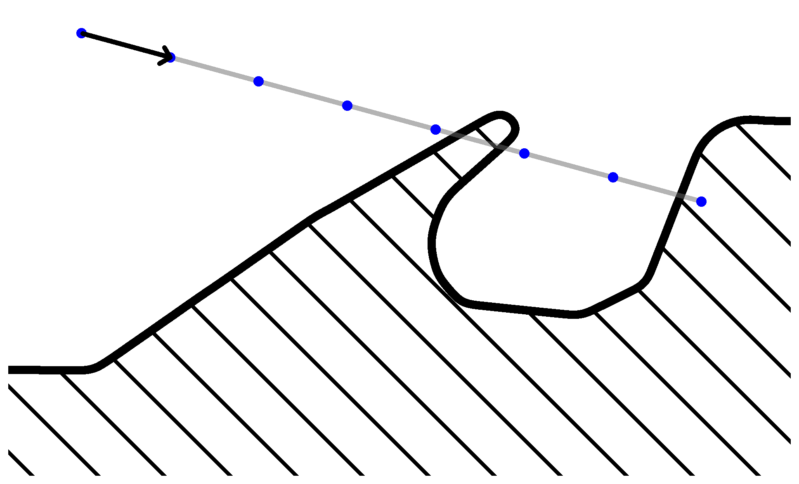
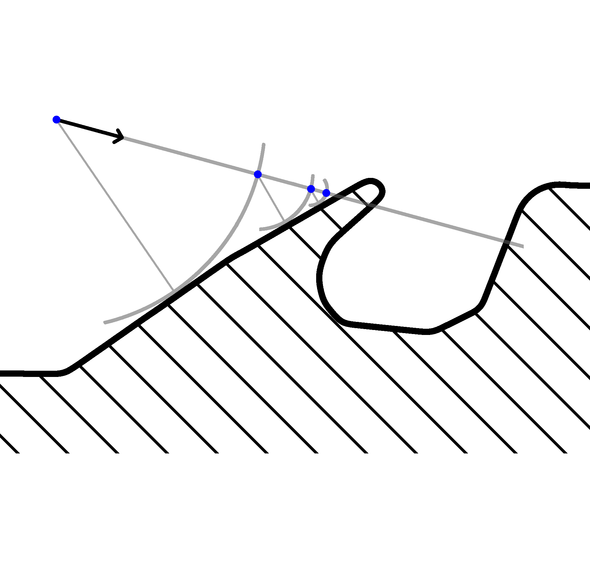
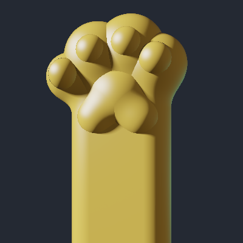

# Introducción

Este informe presenta una biblioteca para describir cuerpos geométricos en tres dimensiones. La biblioteca se basa en operaciones sencillas para crear y combinar cuerpos geométricos de manera composicional y permite extraer un fragmento de programa en el lenguaje de programación gráfica GLSL, que codifica una aproximación a la función de distancia con signo (SDF) del cuerpo geométrico.

Aparte, se incluye un programa que permite visualizar el cuerpo geométrico dentro de un
navegador web moderno, dado el fragmento de código en GLSL.

# Interfaz de la biblioteca

En el módulo Shape, la biblioteca ofrece los siguientes tipos de datos para trabajar con cuerpos geométricos:

    data Shape                                -- un cuerpo geométrico
    type Float3 = (Float, Float, Float)       -- un vector 3-dimensional
    type Float3x3 = (Float3, Float3, Float3)  -- una matriz 3-dimensional

Para construir un cuerpo geométrico, partimos de un único objeto básico:

    point :: Shape -- el punto (0, 0, 0)

Para diseñar objetos más elaborados, se pueden modificar objetos mediante los siguientes operadores: (ver fig.1)

    translate :: Float3 -> Shape -> Shape  -- aplica una traslación
    scale     :: Float -> Shape -> Shape   -- aplica un escalamiento
    rotateX   :: Float -> Shape -> Shape   -- aplica una rotación en el eje X
    rotateY   :: Float -> Shape -> Shape   -- aplica una rotación en el eje Y
    rotateZ   :: Float -> Shape -> Shape   -- aplica una rotación en el eje Z
    inflate   :: Float -> Shape -> Shape   -- infla un cuerpo geométrico
    extrude   :: Float3 -> Shape -> Shape  -- aplica una extrusión

Para diseñar cuerpos aún más elaborados, se tienen los siguientes combinadores: (ver fig.2)

    union :: [Shape] -> Shape
    intersection:: [Shape] -> Shape
    smoothUnion:: Float -> Shape -> Shape -> Shape
    smoothIntersection :: Float -> Shape -> Shape -> Shape

Finalmente, para extraer la codificación en GLSL, se tiene la siguiente función:

    compile :: Shape -> String

# Uso de la biblioteca

Para ilustrar el uso de la biblioteca, veamos cómo crear esferas, cajas y cajas redondeadas.
Para crear una esfera basta con inflar un punto:

    sphere :: Float -> Shape
    sphere radius = inflate radius point

Para crear una caja, basta con extruir un punto según las dimensiones de la caja:

    box :: Float3 -> Shape
    box dimensions = extrude dimensions point

Si queremos crear una caja redondeada, podemos comenzar con una caja y después inflarla para redondear los bordes:

    roundbox :: Float -> Float3 -> Shape
    roundbox radius dimensions = inflate radius (box dimensions)

Sin embargo, si hacemos esto terminamos con un resultado ligeramente más grande de lo esperado, por lo cual se aplica una corrección a las dimensiones de la caja:

    roundbox :: Float -> Float3 -> Shape
    roundbox radius (x, y, z) = inflate radius (box ( x - radius
                                                    , y - radius
                                                    , z - radius ))

Como estos cuerpos son muy comunes a la hora de diseñar escenas, la biblioteca incluye las funciones sphere, box y roundbox. Al final de este informe se ofrece un ejemplo de uso más interesante.

# Decisiones de diseño

Se implementa un eDSL que se compila a GLSL, un lenguaje estilo C que corre en la GPU. Para compilar, resulta cómodo tener un AST, por lo que se eligió un deep embedding. A grandes rasgos, a cada término del lenguaje le corresponde una expresión matemática con números reales, vectores y matrices. Si esta expresión se traduce a GLSL, el código resultante puede usarse para dibujar un cuerpo geométrico en tiempo real.

Para facilitar la conversión a GLSL y reducir el esfuerzo al escribir otros back-ends (en un momento la biblioteca también soportaba compilar a Javascript), se diseñó una representación intermedia llamada FormNl. FormNl es un lenguaje tipado con variables inmutables. FormNl debe ser tipado porque GLSL (el lenguaje objetivo) exige anotaciones de tipo en las variables.

Más tarde, se descubrió que la conversión de Shape a FornNl resultaba engorrosa. Para aliviar este problema, se diseñó Form, una representación intermedia similar a FormNl, pero con expresiones let.

También se implementó un typechecker para Form, que sirvió para encontrar algunos bugs en la traducción de Shape a Form.

Resumiendo, las etapas de compilación son las siguientes:

- *expand*: convierte un término en Shape a un término en Form.
- *infer*: realiza type-checking sobre términos en Form.
- *hoistLet*: convierte un término en Form a un programa equivalente en FormNl.
- *emitGlsl*: convierte un programa en FormNl a un programa equivalente en GLSL.

# Estructura de archivos

El directorio principal contiene dos sub-directorios. El primero, compiler, contiene los archivos referidos a la implementación del eDSL. El segundo, viewer, contiene archivos referidos a un visualizador.

Alfabéticamente, los archivos referidos al eDSL son:

- *compiler/Codegen.hs*: Define la conversión de FormNl a código GLSL.
- *compiler/Core.hs*: Define los AST de Form y FormNl.
- *compiler/Crosscutting.hs*: Define tipos de datos transversales al proyecto.
- *compiler/Examples.hs*: Contiene ejemplos de uso.
- *compiler/Expand*: Define la conversión de Shape a Form.
- *compiler/Form.hs*: Define funciones útiles para construir términos en Form.
- *compiler/GlPrinter*: Define funciones útiles para generar código GLSL.
- *compiler/HoistLets*: Define la conversión de Form a FormNl.
- *compiler/Shape*: Define la biblioteca Shape.
- *compiler/ShapeAst.hs*: Define el AST para Shape.
- *compiler/Typechecking*: Implementa un typechecker sobre términos de Form.
- *compiler/VarLookup.hs*: Define una estructura de datos opaca para ligar variables.

# Funciones de distancia con signo

Para representar un cuerpo, se utiliza una codificación conocida como funciones de distancia con signo (SDF, por sus siglas en inglés) [1]. Para motivar esta codificación resulta necesario estudiar una posible solución al problema del dibujo y sombreado de cuerpos en tres dimensiones.

## Algoritmo ray marching

Una técnica conocida para dibujar cuerpos en tres dimensiones es el raymarching. La técnica consiste en disparar rayos desde la cámara hacia un modelo 3D y buscar intersecciones con él. A diferencia de otros métodos como el trazado de rayos, el raymarching busca intersecciones de manera iterativa: comenzando en el origen del rayo, avanza incrementalmente hasta estar dentro del cuerpo. En ese momento se registra una intersección y la búsqueda termina. 

    algorithm ray-marching(origen: R3, direccion: R3)
    begin
      t ← 1.0
      for i = 1...max do
        if dentro_del_cuerpo(origen + direccion * t) then
          return (origen + direccion * t)
        else
          t ← t + salto
        end
      end
    end

Si bien esta es una solución válida, nos deja dos problemas por resolver:

- Se debe elegir cuidadosamente la distancia que avanza el rayo en cada paso: si es demasiado grande podría saltarse detalles pequeños del cuerpo que se quiere dibujar (ver fig.3) y si es demasiado chica puede volverse necesario realizar muchos pasos, lo cual deteriora el rendimiento.
- Hay que poder verificar si un punto está dentro del cuerpo. Esto, en el caso general, se considera un problema difícil.

## Algoritmo sphere tracing

Una variante del algoritmo raymarching propone responder ambas incógnitas con una herramienta adicional. Supongamos que se pudiera consultar, para cualquier punto del espacio, el mayor radio de una esfera, centrada en ese punto, que no toca el cuerpo que se quiere dibujar (ver fig.4). Se puede concluir que si un rayo avanzara esa distancia (en cualquier dirección) entonces no tocaría el objeto en cuestión.

Observemos que ese radio es exactamente la distancia euclidiana del punto consultado al cuerpo. Esto nos sugiere un criterio de parada para la búsqueda: frenar cuando la distancia sea suficientemente chica como para ser despreciable.

    algorithm sphere-tracing(origen: R3, direccion: R3)
    begin
      t ← 1.0
      for i = 1...max do
        d ← distancia(origen + dirección * t)
        if d < eps then
          return (origen + dirección * t)
        else
          t ← t + d
        end
      end
    end

## Funciones de distancia

Finalmente, nos queda calcular la distancia de cualquier punto al cuerpo. Para lograr esto, se genera una función D: R3→R, basándose en reglas ad-hoc que se detallan más adelante. Para que componga bien, D(p) debe dar el opuesto de la distancia a la superficie para todo punto p dentro del cuerpo.

Vale la pena comentar que para que el algoritmo sea correcto, basta con que D sea una cota inferior a la distancia, que sea continua, y que sea 0 sólo donde la distancia real es menor o igual a 0.  Alguna de la funcionalidad de la biblioteca depende fundamentalmente de este requisito relajado.

# La biblioteca como lenguaje

Se puede pensar la biblioteca como un lenguaje de programación. Al tomar esta perspectiva, podemos estudiar su semántica. Acá se da una semántica denotacional del lenguaje:

                          [[ point ]] = λx: R3. ||x||
                  [[ translate v s ]] = λx: R3. [[s]](x - v)
                      [[ scale k s ]] = λx: R3. [[s]](k-1 x) k
                    [[ rotateX k s ]] = λx: R3. [[s]](Rx(k)-1 x)
                    [[ rotateY k s ]] = λx: R3. [[s]](Ry(k)-1 x)
                    [[ rotateZ k s ]] = λx: R3. [[s]](Rz(k)-1 x)
                    [[ inflate k s ]] = λx: R3. [[s]](x) - k
               [[ union s1 s2 … sn ]] = λx: R3. min { [[s1]](x); [[s2]](x); …; [[sn]](x) }
        [[ intersection s1 s2 … sn ]] = λx: R3. max { [[s1]](x); [[s2]](x); …; [[sn]](x) }
           [[ smooth-union k s1 s2 ]] = λx: R3. smooth-min([[s1]](x), [[s2]](x), k)
    [[ smooth-intersection k s1 s2 ]] = λx: R3. smooth-max([[s1]](x), [[s2]](x), k)
                    [[ extrude v s ]] = λx: R3. [[s]](f(x1, v1), f(x2, v2), f(x3, v3)) + g(x, v) [2]

dónde

    Rɑ(k) = la matriz de rotación de k radianes sobre el eje ɑ
    smooth-min(a, b, k) = min(a, b) - w(a - b, k)
    smooth-max(a, b, k) = max(a, b) + w(a - b, k)
    w(x, k) = ⅙ k (max { 0; k - |x| } / k)3
    f(x, k) = x - max { -k; min { x; k } }
    g(u, v) = min { 0; max { μ(u - v); μ(-u - v) } }
    μ(v1, v2, v3) = max { v1; v2; v3 }

# Trabajo futuro

Como herramienta de creación de imágenes, falta algo fundamental: el uso del color. Sería interesante estudiar una extensión de Shape que permita asignar distintos colores a distintas partes de un cuerpo.

Para sombrear un cuerpo geométrico, es fundamental conocer la dirección de la superficie en cada punto que queramos sombrear. Bajo ciertas suposiciones, esta coincide con el gradiente de la SDF, por lo que es fácil de aproximar numéricamente con 5 evaluaciones adicionales. Para evitar estas evaluaciones, se podría diferenciar la SDF de forma automática.

# Apéndice 1 - Visualizador y ejemplo de uso

El proyecto trae un visualizador en la forma de un archivo viewer/index.html que puede ejecutarse en cualquier navegador web que soporte WebGL (recomendado: Firefox).

El visualizador consiste de una pantalla que muestra un modelo 3D y una entrada de texto que permite cargar un SDF para mostrar. En esa entrada de texto debe pegarse la salida de compile. Por ejemplo, si tenemos cargado en ghci el archivo Examples.hs, podemos ejecutar

    *Examples> putStrLn $ compile patita

Y obtenemos la siguiente salida:

    vec3 v0 = pos;
    vec3 v1 = (v0 - clamp(v0, vec3(-5.0e-2, -0.25, -9.9 ...
    vec3 v2 = (abs(v0) - vec3(5.0e-2, 0.25, 9.999998e-3 ...
    float v3 = ((length(v1) + min(0.0, max(max(v2.x, v2 ...
    ... se omiten 18 líneas ...

Esta misma salida (incluyendo saltos de línea) es la que se debe pegar en la entrada de texto del visualizador.

# Apéndice 2 - Programa de ejemplo

    module Example where
    import Shape

    dedo0 = translate (-0.070, 0.26, -0.015) $ sphere 0.06
    dedo1 = translate (-0.020, 0.29, -0.010) $ sphere 0.07
    dedo2 = translate ( 0.045, 0.28, -0.010) $ sphere 0.07
    dedo3 = translate ( 0.100, 0.24, -0.020) $ sphere 0.05
    dedos = union [dedo0, dedo1, dedo2, dedo3]

    almohadilla0 = translate (-0.070, 0.26, -0.010) $ sphere 0.03
    almohadilla1 = translate (-0.020, 0.29, -0.010) $ sphere 0.03
    almohadilla2 = translate ( 0.045, 0.28, -0.010) $ sphere 0.03
    almohadilla3 = translate ( 0.100, 0.24, -0.006) $ sphere 0.03
    almohadillas = translate (0.0, 0.0, -0.05)
                 $ union [ almohadilla0
                         , almohadilla1
                         , almohadilla2
                         , almohadilla3 ]

    palma0 = sphere 0.07
    palma1 = translate (-0.04, -0.04, -0.025) $ sphere 0.04
    palma2 = translate ( 0.04, -0.04, -0.025) $ sphere 0.04
    palma = translate (0.0, 0.2, -0.01)
          $ smoothUnion 0.02 palma0 (union [palma1, palma2])

    forma = roundbox 0.05 (0.1, 0.3, 0.06)
    brazo = smoothUnion 0.03 forma dedos

    patita = union [brazo, almohadillas, palma]

Al ingresar el resultado de `compile patita` al visualizador, se obtiene la siguiente imagen:

